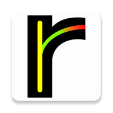
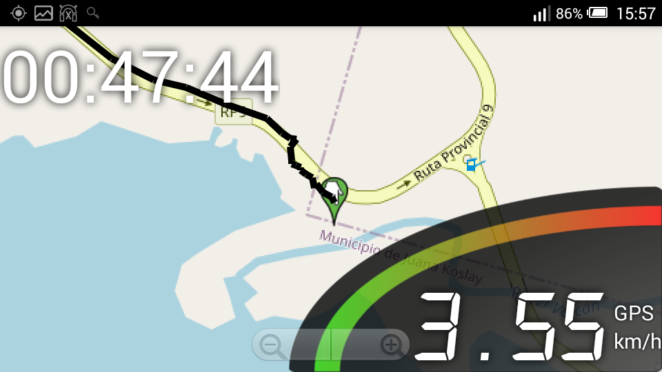
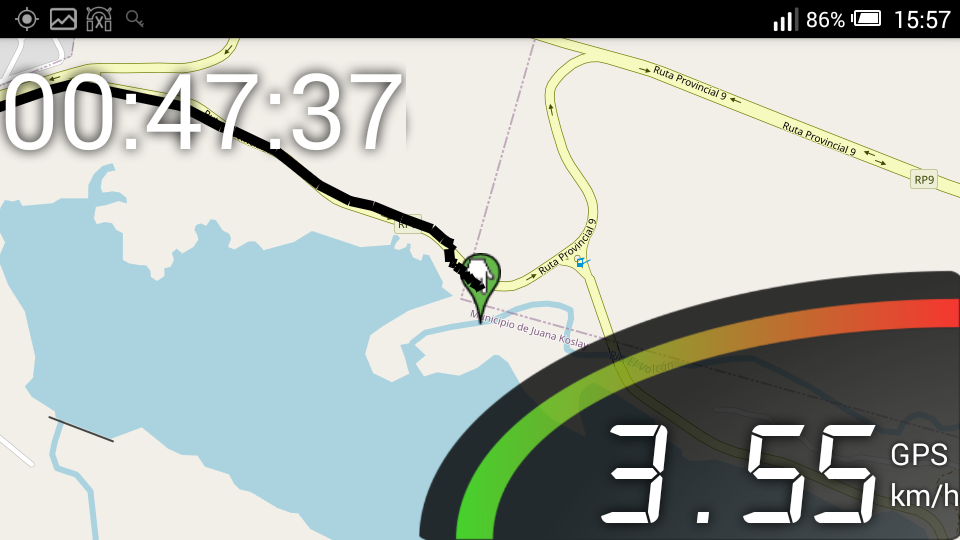
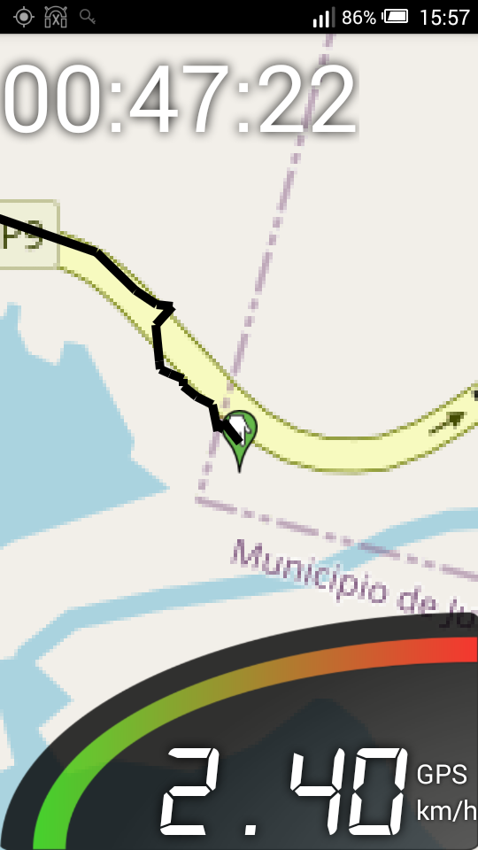

#  rutera

Aplicación para Android que ofrece la velocidad según el GPS.

## Características:
* Tiempo transcurrido.
* Velocidad actual.
* Velocidad máxima.
* Ubicación actual.
* Trayecto recorrido.
* Trayecto con velocidad en cada punto.
* Distáncia en cada punto.
* Registro de las coordenadas recolectadas.
* Mapa de Open Street Map.
* Obviamente no usa servicios de Google (PRIVACIDAD).
* Fotografía personal para capturas de pantalla.

## Capturas

## Características previstas:
La idea es poder obtener datos para luego comparar con otras sesiones y ver el progreso o compartir con otros usuarios / deportistas y presumir.
En futuras versiones recolectará información del clima (la velocidad del viento puede afectar el recorrido).

Esta es una versión inicial.

## Advertencia:
La precisión de los datos recolectados depende de la calidad del dispositivo y la calidad de señeal GPS recibida.
No es propósito de esta aplicación ofrecer información de rendimiento para el deportista profesional.
Los datos pueden ser erroneos, modificados y eliminados, no debe usarse para competencias.
Es simplemente un accesorio.
Esta utilidad la he desarrollado para uso personal y no posee fines comerciales ni profesionales.

## Donaciones

* Libre de Publicidad.
* Libre de Rastreadores.
* Libre de Telemetría.
* Libre de Código Propietario.
* Libre... de ingresos.

Al no tener publicidad este proyecto se mantiene únicamente con donaciones.
Siguiendo este enlace tendrás más información y también más aplicaciones.
[Más información](https://gitlab.com/javipc/mas) 

